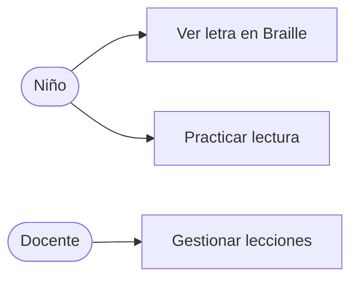

# Diagrama de ejemplo (Mermaid)

Reemplazar con los diagramas reales del proyecto. GitHub los dibuja directamente.

```mermaid
flowchart LR
    Nino([Niño]) --> A[Ver letra en Braille]
    Nino --> B[Practicar lectura]
    Docente([Docente]) --> C[Gestionar lecciones]
```
